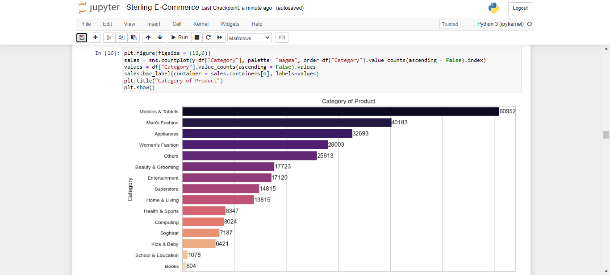
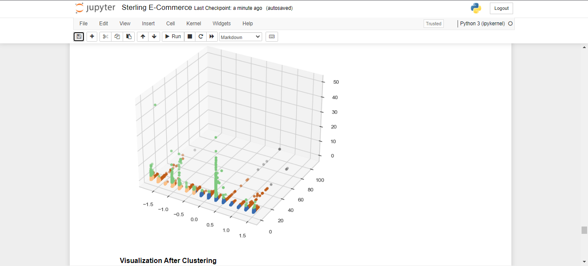
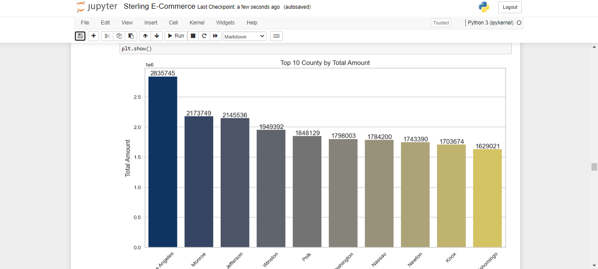
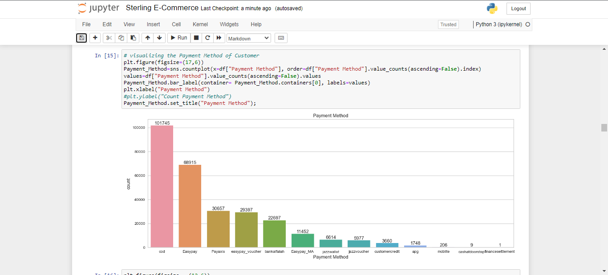
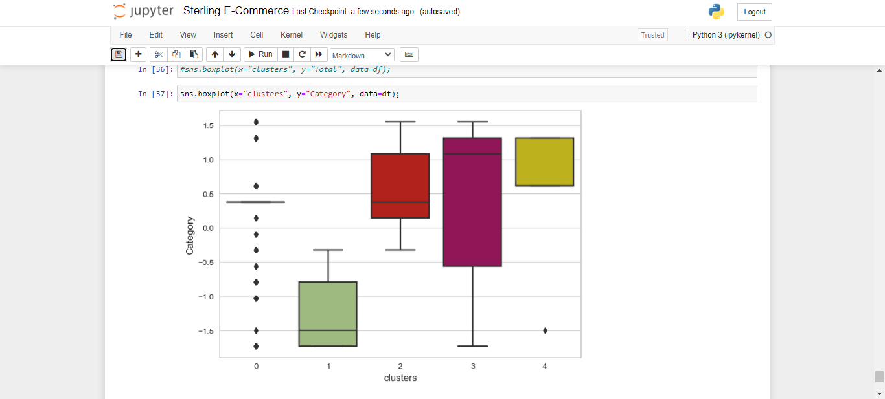

## E-Commerce Sales Prediction

I highly recommend this comprehensive e-commerce strategy study. Leveraging advanced machine learning algorithms for customer segmentation and data analysis is pivotal in today's competitive e-commerce landscape. By aligning marketing efforts with customer preferences and desires, this approach promises to enhance market presence and drive substantial sales growth. It's a strategic move towards delivering precisely what customers want and staying ahead in the evolving e-commerce industry.

 

 
